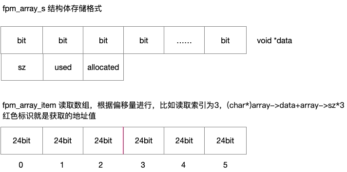

# fpm_arrays 数组处理

主要提供一些数组操作，这里的数组主要用于注册清理函数及socket使用。

数组内存存放在一块内存里，在数据量小的时候能使用cpu二级缓存，提高缓存读取速度

fpm_array_init 初始化数组，只是初始化内存，并没有使用其值，所以used为0

fpm_array_item 使用偏移量获取数组索引值

fpm_array_item_last 获取使用数据最后一个值

fpm_array_item_remove 使用内存复制，将最后一位数组值复制到需要删除的索引，这里数组索引
并不能保证顺序，使用值减一。

fpm_array_push 添加数组值，如果used和allocated一样.这里有两种情况就是内存不够用和allocated为0的情况，内存不够用的话，将数组内存乘以2.如果为0，将其allocated默认值设置为20。
将申请的内存地址返回，used加1.注意这里偏移量是从0开始，所以++a->used放在后面。

